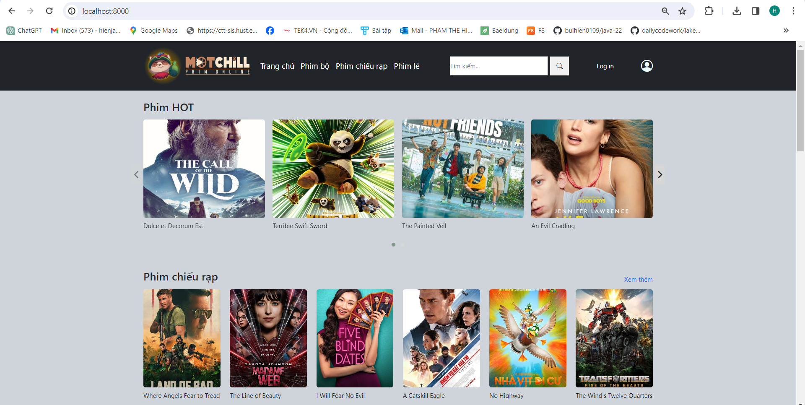
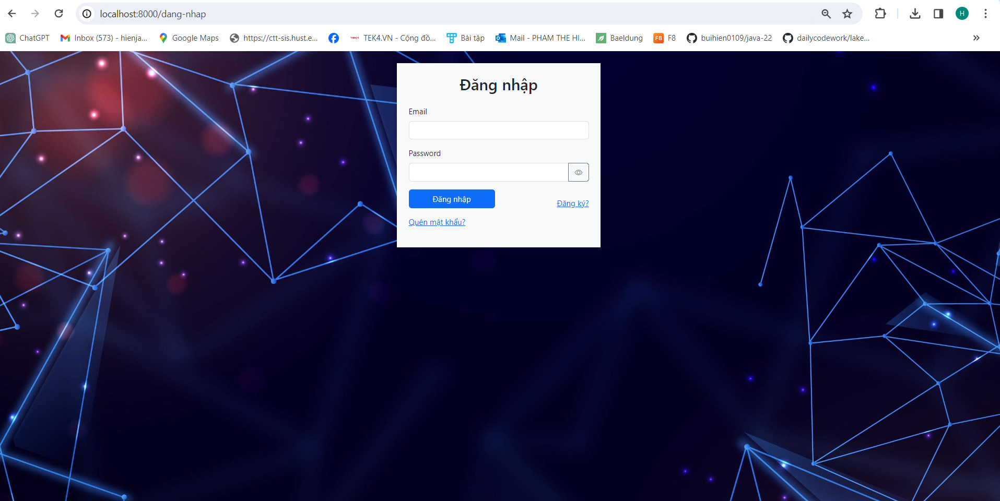
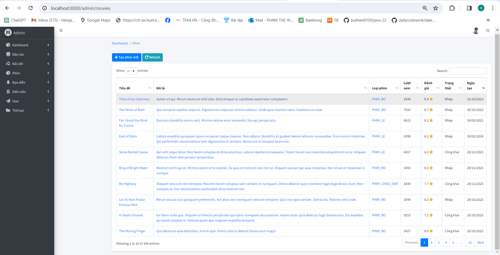
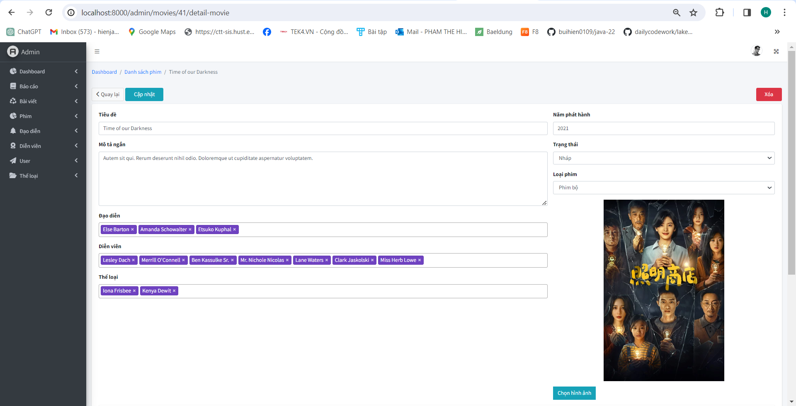
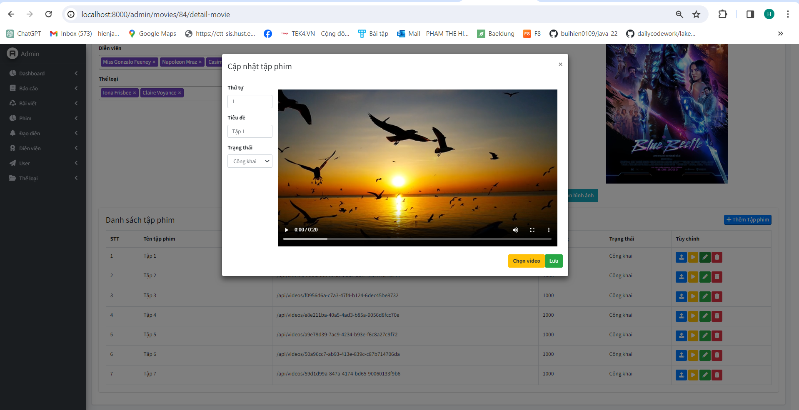
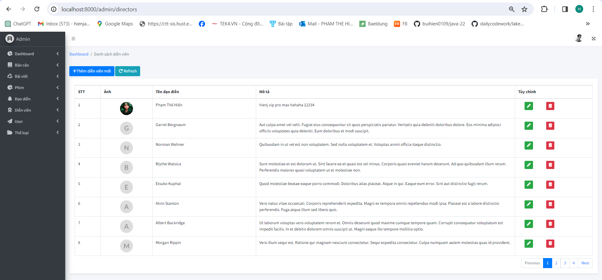

# SOCIAL NETWORK

## Project Description:
Build a movie website with many basic functions
## Tech Stack Used:
```bash
    - Frontend: Thymeleaf, HTML , CSS
    - Backend: Java (Spring Boot), Hibernate
    - Database: MySql
```
## Functions for Users:
```bash
    - Login/sign up
    - Review 
    - Watch movie 
    - Blog
```
## Some features of the site:
Home Page 1                   |                   Home page 2
:---------------------------------:        |      :------------------------------:
  | 

Log in                    |                       Sign up
:---------------------------------:        |      :------------------------------:
  | 

- Detail movie


List review                    |                      Create and update review 
:---------------------------------:            |      :------------------------------:
  | 
- Watch movie


List blog                                      |                       Blog detail 
:---------------------------------:            |      :------------------------------:
  | 
## Functions for Admin:
```bash
    - Dashboard: View new user, new movie information during the month
    - Movie: Add, edit and delete movie information
    - Genre: Add, edit and delete genre information
    - Director: Add, edit and delete director information
    - Actor: Add, edit and delete actor information
    - Blog: Add, edit and delete blog information
```
- Dashboard

- Movie management


Update movie information                       |                      Update movie episode
:---------------------------------:            |      :------------------------------:
  | 

- Genre


Director                                          |           Director update
:---------------------------------:            |      :------------------------------:
  | 

Actor                                          |           Actor update
:---------------------------------:            |      :------------------------------:
  | 

Blog                                               |         Blog update
:---------------------------------:                 |      :------------------------------:
  | 

